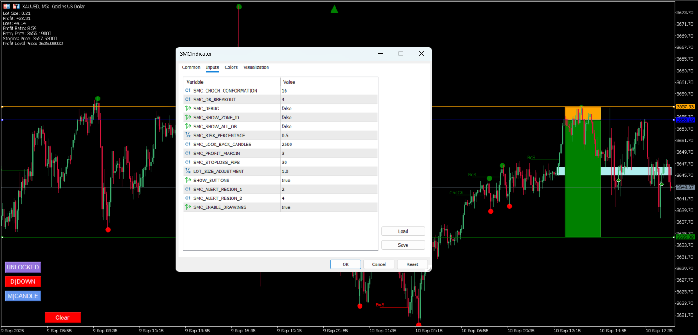
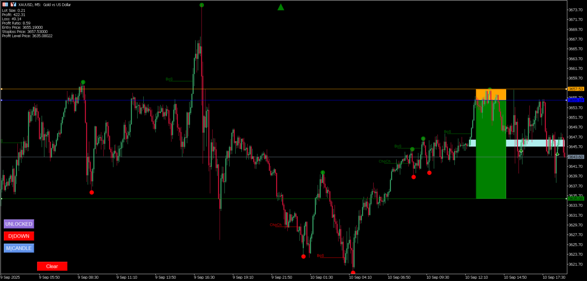

# Smart Money Concept (SMC) Indicator

## Overview

The Smart Money Concept (SMC) Indicator is an advanced MetaTrader 5 (MT5) indicator that automates the identification and marking of key market structure elements based on the Smart Money Concept trading methodology. This indicator eliminates the time-consuming manual process of marking high/low points, detecting trends, zones, and order blocks, providing traders with automated analysis tools for better market understanding.





## Features

### Core Functionality
- **Automated Market Structure Analysis**: Automatically identifies and marks significant market structure elements
- **Trend Detection**: Detects and visualizes market trends with high accuracy
- **Zone Identification**: Identifies key support and resistance zones automatically
- **Order Block Detection**: Finds and marks institutional order blocks
- **Break of Structure (BoS) Detection**: Identifies trend continuation patterns
- **Change of Character (ChoCh) Detection**: Identifies potential trend reversal points
- **Signal Generation**: Provides automated buy/sell signals based on SMC principles

### Visual Elements
- **Interactive Chart Objects**: Draggable entry, stop-loss, and take-profit levels
- **Color-Coded Zones**: Different colors for different types of market structures
- **Trend Arrows**: Visual indicators for current market trend direction
- **Order Block Rectangles**: Clear visualization of institutional order blocks
- **Signal Arrows**: Buy/sell signal indicators on the chart

### Advanced Features
- **Risk Management Tools**: Built-in position sizing and risk calculation
- **Alert System**: Real-time notifications for signals and structure breaks
- **CSV Export**: Export market data for further analysis
- **Multi-Timeframe Support**: Works across different chart timeframes
- **Customizable Parameters**: Extensive configuration options for different trading styles

## Installation

### Prerequisites
- MetaTrader 5 platform
- MQL5 programming environment (for compilation)

### Installation Steps
1. Download the indicator files to your local machine
2. Copy the entire `SMCIndicator` folder to your MT5 `Indicators` directory:
   ```
   MetaTrader 5/MQL5/Indicators/SMCIndicator/
   ```
3. Open MetaTrader 5 and navigate to the Navigator panel
4. Right-click on "Indicators" and select "Refresh"
5. Locate "SMCIndicator" in the Custom Indicators section
6. Drag and drop the indicator onto your chart

### Compilation
If you need to compile the indicator:
1. Open MetaEditor (F4 in MT5)
2. Open the `SMCIndicator.mq5` file
3. Press F7 or click the Compile button
4. Ensure no compilation errors

## Configuration

### Input Parameters

#### General Settings
- **SMC_LOOK_BACK_CANDLES** (default: 2500): Number of historical candles to analyze
- **SMC_DEBUG** (default: false): Enable debug mode for additional visual information
- **SMC_SHOW_ZONE_ID** (default: false): Display zone identification numbers
- **SMC_SHOW_ALL_OB** (default: false): Show all order blocks (not just current zone)

#### Structure Detection
- **SMC_CHOCH_CONFORMATION** (default: 16): Candles required for ChoCh confirmation
- **SMC_BOS_LINE_WIDTH** (default: 20): Visual width for BoS lines
- **SMC_CHOCH_LINE_WIDTH** (default: 20): Visual width for ChoCh lines
- **SMC_OB_BREAKOUT** (default: 4): Candles required for order block breakout confirmation

#### Risk Management
- **SMC_RISK_PERCENTAGE** (default: 0.5): Risk percentage per trade
- **SMC_PROFIT_MARGIN** (default: 3): Risk-to-reward ratio multiplier
- **SMC_STOPLOSS_PIPS** (default: 30): Default stop-loss in pips
- **LOT_SIZE_ADJUSTMENT** (default: 1): Position size adjustment factor

#### Alert Settings
- **SMC_ALERT_REGION_1** (default: 2): First alert region for signals
- **SMC_ALERT_REGION_2** (default: 4): Second alert region for signals
- **SMC_ENABLE_DRAWINGS** (default: true): Enable/disable visual elements

## Usage

### Basic Operation
1. **Apply the Indicator**: Drag the indicator onto your chart
2. **Configure Parameters**: Adjust settings according to your trading style
3. **Analyze Structure**: The indicator will automatically mark market structure elements
4. **Monitor Signals**: Watch for buy/sell signals and structure breaks

### Interactive Features
- **Click to Set Orders**: Click on candles to set entry, stop-loss, and take-profit levels
- **Drag to Adjust**: Drag the horizontal lines to adjust order levels
- **Mode Switching**: Use the control buttons to switch between zone and candle modes
- **Position Locking**: Lock positions to prevent accidental modifications

### Control Buttons
- **Clear**: Remove all current order settings
- **M|ZONE/M|CANDLE**: Switch between zone-based and candle-based order placement
- **D|UP/D|DOWN**: Set trade direction (candle mode only)
- **LOCKED/UNLOCKED**: Lock or unlock position modifications
- **CSV**: Export market data to CSV file

## Market Structure Elements

### Order Blocks
- **Bullish Order Blocks**: Areas where institutions placed buy orders
- **Bearish Order Blocks**: Areas where institutions placed sell orders
- **Validity Tracking**: Automatic tracking of order block validity

### Zones
- **Support Zones**: Areas where price may find support
- **Resistance Zones**: Areas where price may find resistance
- **Zone Regions**: Subdivisions within zones for precise analysis

### Break of Structure (BoS)
- **Continuation Pattern**: Indicates trend continuation
- **Visual Markers**: Clear horizontal lines marking structure breaks

### Change of Character (ChoCh)
- **Reversal Pattern**: Indicates potential trend reversal
- **Confirmation System**: Multi-candle confirmation for reliability

## Signal System

### Signal Types
- **Buy Signals**: Generated when price breaks above order blocks in uptrend
- **Sell Signals**: Generated when price breaks below order blocks in downtrend
- **Entry Conditions**: Based on order block interaction and market structure

### Risk Management
- **Automatic Stop-Loss**: Calculated based on order block levels
- **Take-Profit Levels**: Set using configurable risk-to-reward ratios
- **Position Sizing**: Automatic lot size calculation based on risk percentage

## Alert System

### Alert Types
- **Signal Alerts**: Notifications for new buy/sell signals
- **BoS Alerts**: Notifications for break of structure events
- **ChoCh Alerts**: Notifications for change of character events

### Alert Configuration
- Enable/disable different alert types
- Customize alert messages
- Set up push notifications and email alerts

## Data Export

### CSV Export Features
- **Comprehensive Data**: Export all market structure data
- **Historical Analysis**: Include historical performance metrics
- **Custom Formatting**: Human-readable date and time formats
- **Performance Metrics**: Profit/loss ratios and trade duration data

## Technical Architecture

### Class Structure
- **CCandle**: Individual candle data and trend analysis
- **CCandleGroup**: Groups of candles with similar characteristics
- **CCandleGroupZone**: Market zones containing multiple candle groups
- **COrderBlock**: Order block detection and management
- **CSignal**: Signal generation and management
- **CChoch**: Change of character detection
- **CBos**: Break of structure detection

### Algorithm Flow
1. **Data Collection**: Gather historical price data
2. **Candle Analysis**: Analyze individual candle trends
3. **Group Formation**: Group candles with similar characteristics
4. **Zone Creation**: Create market zones from candle groups
5. **Structure Detection**: Identify BoS and ChoCh patterns
6. **Order Block Detection**: Find institutional order blocks
7. **Signal Generation**: Generate trading signals
8. **Visual Rendering**: Display all elements on chart

## Performance Optimization

### Memory Management
- **Efficient Data Structures**: Optimized arrays and objects
- **Memory Cleanup**: Proper object destruction and cleanup
- **Buffer Management**: Efficient buffer resizing and management

### Calculation Efficiency
- **Incremental Updates**: Only recalculate when new data arrives
- **Optimized Algorithms**: Efficient trend and structure detection
- **Minimal Redraws**: Reduce unnecessary chart redraws

## Troubleshooting

### Common Issues
1. **Indicator Not Loading**: Ensure all files are in the correct directory
2. **Compilation Errors**: Check for missing includes or syntax errors
3. **No Visual Elements**: Verify SMC_ENABLE_DRAWINGS is set to true
4. **Performance Issues**: Reduce SMC_LOOK_BACK_CANDLES for better performance

### Debug Mode
Enable debug mode to see additional information:
- Candle group markings
- Zone identification numbers
- Additional visual elements

## Best Practices

### Trading Recommendations
1. **Combine with Price Action**: Use alongside traditional price action analysis
2. **Multiple Timeframes**: Analyze higher timeframes for context
3. **Risk Management**: Always use proper risk management
4. **Backtesting**: Test strategies before live trading
5. **Market Conditions**: Consider market volatility and conditions

### Parameter Optimization
1. **Start with Defaults**: Begin with default parameters
2. **Gradual Adjustment**: Make small adjustments and test results
3. **Market-Specific**: Adjust parameters for different markets
4. **Regular Review**: Periodically review and optimize settings

## Support and Updates

### Getting Help
- Review the configuration parameters
- Check the debug mode for additional information
- Analyze the CSV export for detailed data
- Test with different timeframes and markets

### Future Enhancements
- Additional market structure elements
- Enhanced signal filtering
- More customization options
- Performance improvements

## Disclaimer

This indicator is provided for educational and analysis purposes. Trading involves substantial risk of loss and is not suitable for all investors. Past performance is not indicative of future results. Always conduct your own research and consider your risk tolerance before trading.

## License
Copyright © 2025 LesleyJJ. All rights reserved.

---

**Note**: This indicator is designed for MetaTrader 5 platform and requires MQL5 programming knowledge for customization. Always test thoroughly in a demo environment before using with real funds. The full source code is not publicly available. If you are interested in accessing the source code or collaborating, please  [contact me](mailto:jacobjohnlesley@gmail.com).
